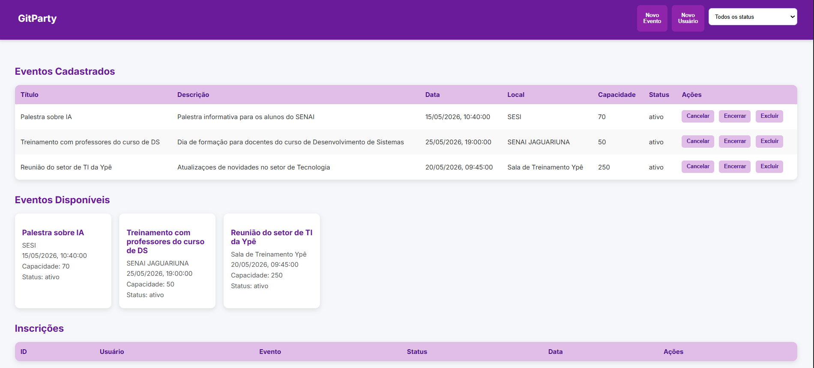
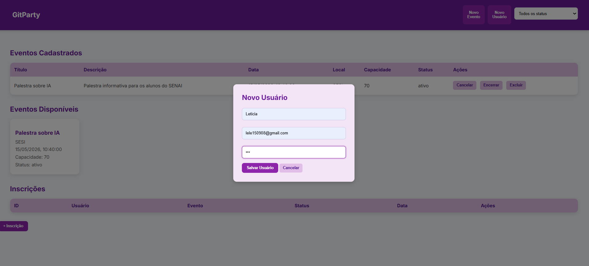
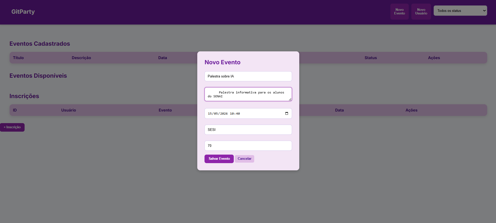
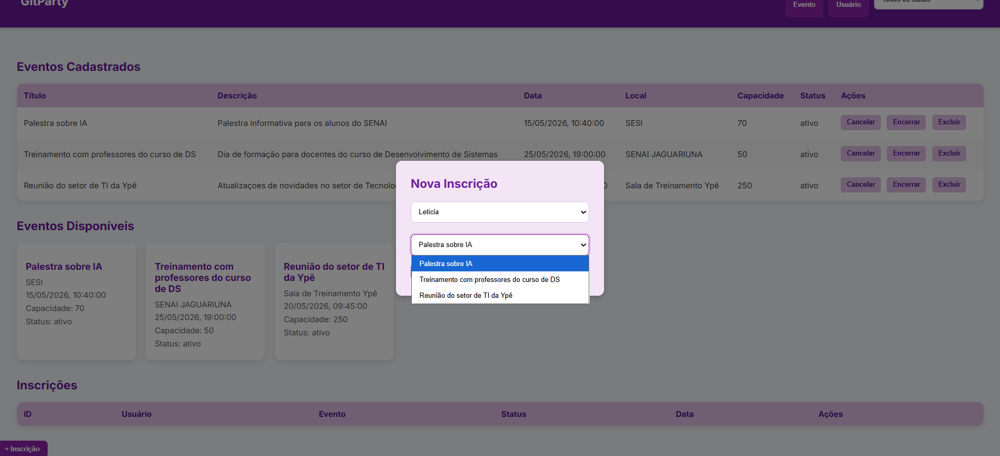

# GitParty - Sistema de Gestão de Eventos

## Sobre o Projeto

O GitParty é um sistema web desenvolvido para gerenciar eventos de tecnologia, como palestras, workshops e treinamentos.

O sistema foi criado para resolver problemas no controle manual de participantes, permitindo:

- cadastro de usuários;
- cadastro de eventos;
- gerenciamento de inscrições;
- controle de vagas;
- lista de espera automática;
- cancelamento de inscrições;
- filtro de eventos por status.

---

#  Tecnologias Utilizadas

- HTML
- CSS
- JavaScript
- LocalStorage

---

# Funcionalidades

## 👤 Usuários
- Cadastro de participantes

## 📅 Eventos
- Cadastro de eventos
- Cancelamento e encerramento
- Exclusão de eventos
- Filtro por status

## 📝 Inscrições
- Controle de capacidade máxima
- Lista de espera automática
- Bloqueio de inscrições duplicadas
- Cancelamento até 24h antes do evento
- Promoção automática da fila de espera

---

# Prints do Sistema

## Tela Inicial

## Inscrições

## Cadastro de Evento

## Inscrições

---

#  Como Executar

1. Abra o projeto no VS Code
2. Execute com Live Server
3. Utilize o sistema no navegador

---

# Desenvolvido por Letícia Corrêa

Projeto acadêmico desenvolvido com HTML, CSS e JavaScript.